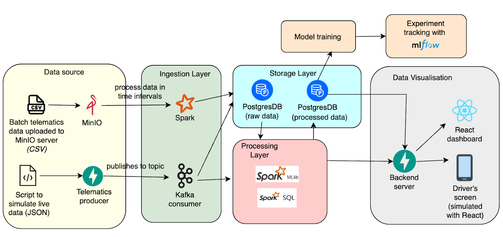

# Driver Safety Detector

## Table of Contents
1. [Background](#background)
2. [Architecture](#architecture)
3. [Folder Structure](#folder-structure)
4. [Getting Started](#getting-started)
   - [Docker](#docker)
   - [Running each service](#running-each-service)
     - [Batch Processing (Ingestion)](#1-batch-processing-ingestion)
     - [Batch Processing (Data Consolidation)](#2-batch-processing-data-consolidation)
     - [Analytics Processing (Model Training)](#3-analytics-processing-model-training)
     - [Model Updating](#4-model-updating)
     - [Stream Processing (Ingestion & Prediction)](#5-stream-processing-ingestion--prediction)
     - [Visualisation](#6-visualisation)
   - [Python Virtual Environment](#python-virtual-environment)
5. [Services](#services)
6. [Kafka Topics](#kafka-topics)
7. [Data](#data)
8. [Troubleshooting](#troubleshooting)

## Background

Ride-hailing companies collect telematics data from the private-hire cars during their trips. By building a data pipeline which utilises the huge amounts of telematics data collected by these companies, a model can be built to detect dangerous driving trips.


## Architecture



## Folder Structure

```
├──- docker-compose-kafka.yml        Docker compose file to start up all Kafka services containers
├──- docker-compose.yml              Docker compose file to start up all application containers
├──- docker-compose-storage.yml      Docker compose file to start up all storage containers
🗂️── backend                         FastAPI server to serve data to frontend
🗂️── consumer                        Consumer application code
🗂️── data                            Store data to be used for application (Would be made avaiable upon startup of MinIO)
🗂️── feature_engineering_exp         Jupyter notebook experiments for feature engineering
🗂️── frontend                        Frontend for visualizing insights on telematics data and ride safety
🗂️── producer                        Producer application code
🗂️── spark-server                    Spark server to run Spark jobs
```

## Getting Started

### Docker
Ensure that docker is already installed. Ensure you have at least 12 GB of memory and CPU limit of 8 configured on your Docker to prevent any services from crashing.

You will need to build the following images in their respective folders:

```sh 
# backend image (run in backend folder)
docker build -t backend .

# consumer image (run in consumer folder)
docker build -t consumer .

# frontend image (run in frontend folder)
docker build -t frontend .

# producer image (run in producer folder)
docker build -t producer .

# batch-processing image (run in spark-server folder)
docker build -t spark-server .
```

Start all services with:
```sh
docker-compose -f docker-compose-kafka.yml -f docker-compose-storage.yml -f docker-compose.yml up -d
```

You can view the started containers on Docker Desktop.

Stop all services with:
```sh
docker-compose -f docker-compose-kafka.yml -f docker-compose-storage.yml -f docker-compose.yml down
```

### Running each service

#### 1. Batch Processing (Ingestion)
To run batch processing for raw data ingestion, run the following command:
```sh
curl -X POST http://localhost:8002/filepath -H "Content-Type: application/json" -d '{"filepath":"bigdata/XXXXXX.csv"}'
```

The system takes in a parameter of filepath, indicating the path of the files in the Minio storage server. If the file is placed in the data folder prior to the start up of the Minio server, the file can be found at the bucket `bigdata/file_name.csv` in the Minio server.

#### 2. Batch Processing (Data Consolidation)

After ingestion of data, we need to further prepare the data required for our analytics purposes, either on demand or running on a daily basis, this process will perform the necessary ETL on the raw data and make it ready for analytics purposes.

Run the following command:
```sh
curl -X POST http://localhost:8003/command -H "Content-Type: application/json" -d '{"command":"new"}'
```

#### 3. Analytics Processing (Model Training)

The model training will use the data from the telematics table as the training data and testing data. To trigger the model training script, users can send a request using the following command:

```sh
curl -X POST http://localhost:8004/train -H "Content-Type: application/json" \
  -d '{
    "modelname": "RandomForest_Telematic",
    "feature_columns": [
        "std_gyro_z",
        "std_accel_y",
        "std_accel_z",
        "max_accel_x",
        "avg_speed",
        "std_accel_x",
        "max_accel_mag",
        "std_speed",
        "std_gyro_mag",
        "std_gyro_x",
        "max_accel_z",
        "avg_gyro_mag",
        "std_accel_mag",
        "second"
    ]
}'
```

The feature_columns should be an array of strings with feature column names. After the successful model training and logging, it will return the message with a status code `200`.

#### 4. Model Updating

When the server starts, it automatically loads the default model from the MLflow server and begins listening to a Kafka streaming topic. Once it receives 10 records (can be adjusted) associated with a specific bookingID, it performs a prediction using those records and publishes the result to the prediction Kafka topic.

To switch to a different model for prediction, users can send a request using the following command:

```sh
curl -X POST localhost:8005/refresh_model -H "Content-Type: application/json" -d '{"modelname":"Randomforest Model"}'
```

Upon receiving this request, the system will load the specified model by name from the MLflow server and use it for subsequent predictions.

#### 5. Stream Processing (Ingestion & Prediction)

2. To run stream processing for raw data ingestion and for trip safety prediction, run the following command:
```sh
curl -X POST http://localhost:8001/stream_trips_demo
```

This will invoke the `producer` FastAPI server to start streaming live data to the `streaming` Kafka topic. A script will be invoked by the POST request to stream three drivers’ trips simultaneously. The messages in the topic can be seen in Kafdrop (a Kafka web UI) at http://localhost:9001. The messages will be consumed by the Kafka `consumer` for data ingestion.

#### 6. Visualisation

View the frontend at http://localhost:3000. You will be able to see a dashboard showing a summary of all completed trips, as well as a driver's page of the current trip.


### Python Virtual Environment

This is only needed if you are developing the python scripts locally. This is not required for running the docker-compose setup.

1) Create your own virtual environment:
```sh
python3 -m venv myenv
```

2) Activate the virtual environment:
```sh
source myenv/bin/activate
```

3) Install the python packages in the virtual environment:
```sh
pip install -r requirements.txt
```

### Services

| Service Name                                 | Description                                                    | URL                   | Notes                                                             |
|----------------------------------------------|----------------------------------------------------------------|-----------------------|-------------------------------------------------------------------|
| Postgres                                     | Database storage for application                               | http://localhost:8080 | Login with username: `admin@admin.com` and password `admin`              |
| MinIO                                        | Object storage (S3 compatible)                                 | http://localhost:9090 | Webpage access to view and configurate MinIO. Login with username: `miniouser` and password: `miniopassword`                      |
| MinIO Client                                 | MinIO API calls                                                | http://localhost:9000 | No webpage access but used for application to access the content. |
| Kafdrop                                      | Kafka UI for checking topics & messages                        | http://localhost:9001 |                                                                   |
| Backend                                      | FastAPI backend to serve API endpoints                         | http://localhost:8000 | For displaying telematics data on frontend                        |
| Frontend                                     | React frontend                                                 | http://localhost:3000 | Frontend to display telematics data                               |  
| Producer                                     | Sample Service to simulate live data flowing in                | http://localhost:8001 | Called when in need to simulate live data                         |  
| **PySpark**-<br/>Batch Ingestion of Raw Data | Service to carry out ingestion of raw data from files in minio | http://localhost:8002 | Called when in need to ingest raw files into the system           |  
| **PySpark**-<br/>Telematics consolidation    | Service to carry out telematics consolidation of rides         | http://localhost:8003 | Called periodically to consolidate ride information captured      |  
| MLFlow       | Experiment tracking         | http://localhost:5001 | Trained models can be seen on MLFlow dashboard      |  


## Kafka Topics

| Topic name | Description                                                                                                | 
|------------|------------------------------------------------------------------------------------------------------------|
| streaming  | live data received from source, modules should receive and process this data for prediction and/or storage | 
| prediction | prediction results from ML models                                                                          | 

## Data

The data labels and data dictionary can be found in the `/data` folder.
```
├──- labels.csv                Labels for driving trips safety
├──- data_dictionary.xlsx      Data dictionary to explain fields in dataset
  ├──- raw                     Contains raw data used in the application. Manual extraction from the raw dataset below required
```

The raw dataset source is in CSV format and can be found at [kaggle](https://www.kaggle.com/datasets/vancharmlab/grabai).

We have split the raw dataset into two parts:
1) [First part](https://www.kaggle.com/datasets/vancharmlab/grabai?select=part-00000-e6120af0-10c2-4248-97c4-81baf4304e5c-c000.csv) to be served from a **FastAPI server** in **JSON** format
2) [Second part](https://www.kaggle.com/datasets/vancharmlab/grabai?select=part-00001-e6120af0-10c2-4248-97c4-81baf4304e5c-c000.csv) to be stored in a **MinIO file server** in **CSV** format

Download the first part and place it in within the `producer` folder. Download the second part and place it within the `data/raw` folder (you will need to create the `raw` folder).

## Troubleshooting

- To have minimal problems when running the entire setup, increase the resource allocation (CPU and memory limit). A minimum of 12 GB of memory and CPU limit of 8 are recommended.
- If some services are not able to run, it could be due to a conflict of ports (i.e. ports are already used by existing services on your machine). Either ensure that those ports are freed up for use (recommended), or use another port altogether by changing the external ports in the `docker-compose` files